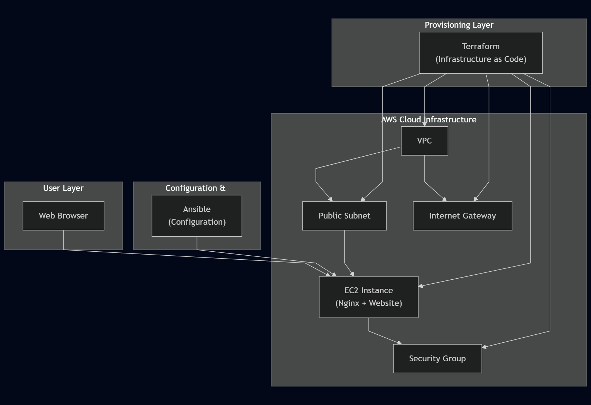

# Website Deployment on AWS EC2 with Terraform & Ansible
📌 Project Overview
This project demonstrates a fully automated deployment of a web application to AWS EC2 using:

- Terraform for infrastructure provisioning

- Ansible for configuration management and application deployment

# 1. Terraform provisions the AWS resources:

- VPC, subnets, internet gateway

- Security groups

- EC2 instance
  

# 2. Ansible connects to the provisioned EC2 instance to:

- Install required packages (Nginx, dependencies)

- Deploy the website files

- Configure and start services

  

  
